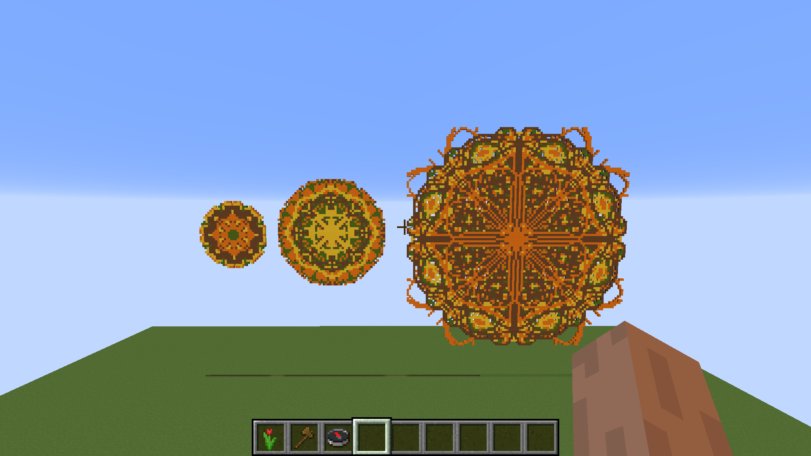
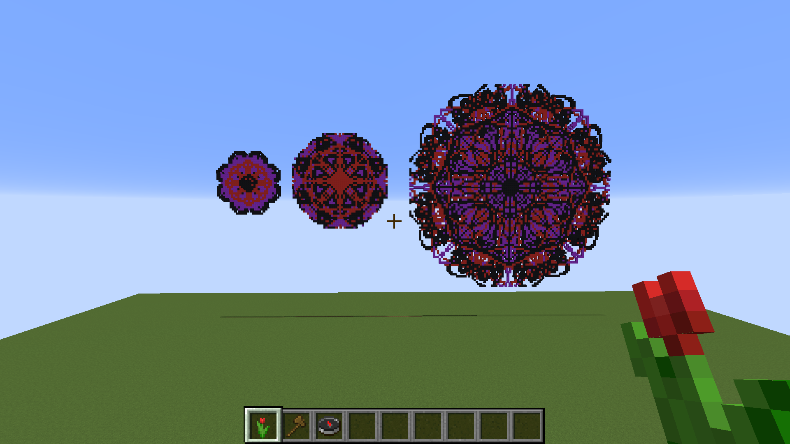
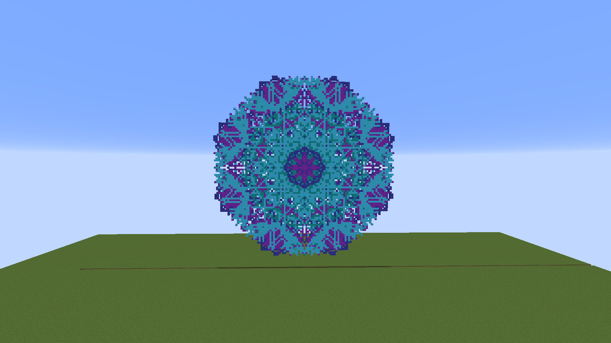
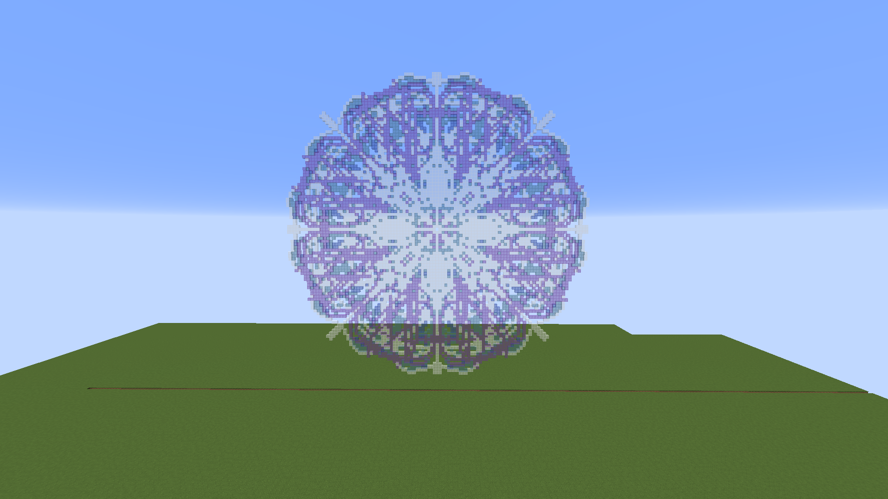

# Mandalas

Mandalas is a plugin to procedurally create mandalas in Minecraft with parameters as size, types of blocks and location specified by the player. See below some of the mandalas created with this plugin.

## Basic usage

Each time you run the command `/mandala` a completely different shape is created, unless you specifically set a seed using the `/ms` command. 

To create a mandala, you must first select its central block, then its radius. You can use the selection tool to define the central block, then set the radius using the `/mr <radius>` command or using the selection tool (right-click) in a block located on the border of the desired region to automatically calculate the radius. The default selection tool is the *red tullip*. See the gif below.


Also, when selecting the central block with the selection tool, the face of the block which received the interaction will determine the drawing plane.

Checkout some mandalas created and the materials used for them. Note that even if you use the same commands, the ones created for you will be completely different from those.

- *Orange*, *Yellow*, *Brown* and *Green Wool* with 15, 25 and 50 radius size, respectively. Command: `/mandala ORANGE_WOOL YELLOW_WOOL BROWN_WOOL GREEN_WOOL`



- *Purple*, *Red* and *Black Wool* with 15, 25 and 50 radius size, respectively. Command: `/mandala PURPLE_WOOL RED_WOOL BLACK_WOOL`



- *Light Blue*, *Cyan*, *Purple*, *Blue Wool* with 50 radius size. Command: `/mandala LIGHT_BLUE_WOOL CYAN_WOOL PURPLE_WOOL BLUE_WOOL`



- *Blue*, *White*, *Cyan*, *Purple Stained Glass* with 50 radius size. Command: `/mandala BLUE_STAINED_GLASS WHITE_STAINED_GLASS CYAN_STAINED_GLASS PURPLE_STAINED_GLASS`



> :warning: The bigger the radius length, the more detailed will be the mandalas, **but also it will require more processing power on the server side to compose the image. Don't crash your server, please :).**


> :warning: I've done tests with a radius up to 150 blocks and my server froze for a couple of seconds. Be wary of this when setting a large radius.

## Advanced usage

You can select the types of elements and their unique parameters that will be used to compose the mandalas. Currently, these are the types available:

- `CURVE_RANDOM`: Random Bézier quadratic curve
- `CURVE_CONVEX`: Convex Bézier quadratic curve
- `CURVE_CONCAVE`: Concave Bézier quadratic curve
- `PETAL`: Petal forms, either single or double-sided

In the `config.yml` file generated in your `.minecraft` directory, you can play with these elements by specifiying how many of each should be used to compose the mandala, set static properties for some or simply tell to the plugin to choose *n* elements from a random pool.

For example, if you want to create mandalas that have all types of elements chosen randomly 15 times, you could use this configuration under the `mandalas.elements` tree:

```yaml
random:
  count: 15
  pool:
    CURVE_RANDOM:
      vertices: 10
      range: [0.5, 0.6]
    CURVE_CONVEX:
      vertices: 10
      range: [0.3, 1.2]
    CURVE_CONCAVE:
      vertices: 10
      range: [0.1, 0.2]
```

The `vertices` parameter specify how many points each Bézier will have, and the `range` parameter specify the lower and upper limits where the element must be drawn inside the mandala, from the center to the border.

If you want a specific type of element with specific parameters, you can set fixed elements in conjunction with the random ones:

```yaml
random:
  count: 15
  pool:
    CURVE_RANDOM:
      vertices: 10
      range: [0.5, 0.6]
    CURVE_CONVEX:
      vertices: 10
      range: [0.3, 1.2]
fixed: 
  PETAL_1: 
    range: [0.5, 0.75]
  PETAL_2: 
    range: [0.1, 0.5]
```

Note that in the `fixed` section, if you want more than one of the same element, but with different parameters, you must name each one respecting the pattern `{ElementType}_X`, where `X` can be anything as long as it is different for each element.

You can also specify the default number of `sections` the mandalas should have. The default is `8`, since this produces the most symmetric figures.

Check the configuration file for more information.

## Commands

See the plugin description for each command.

```
/mandala <material1> <material2> ...
/ms <seed> <material1> <material2> ...
/mr <radius>
```

## Permissions

```
mandalas.create
mandalas.set_tool
```

## Acknowledgements

I used [this post](https://mathematica.stackexchange.com/a/136986) made by Anton Antonov as the initial idea for the generation algorithm. Thank you for your awesome work.
